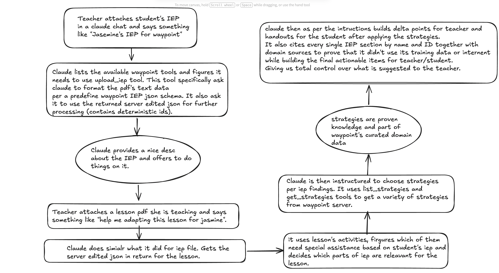
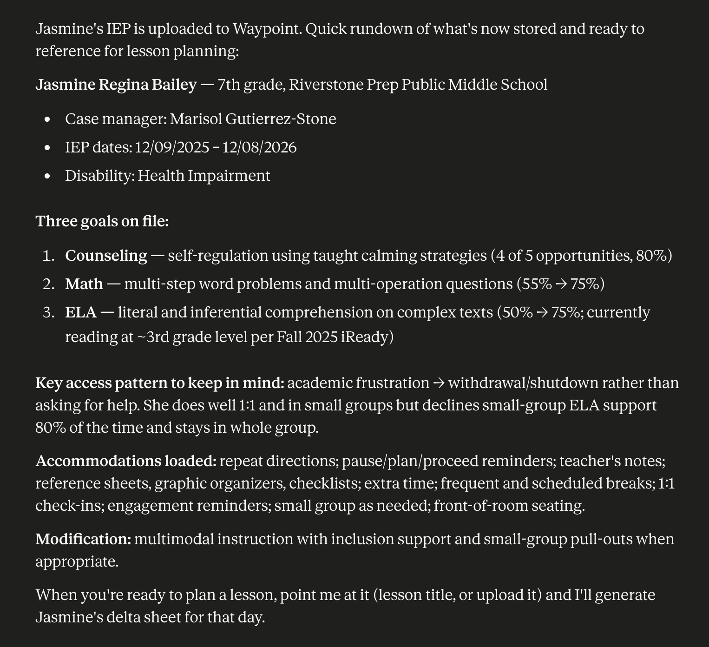
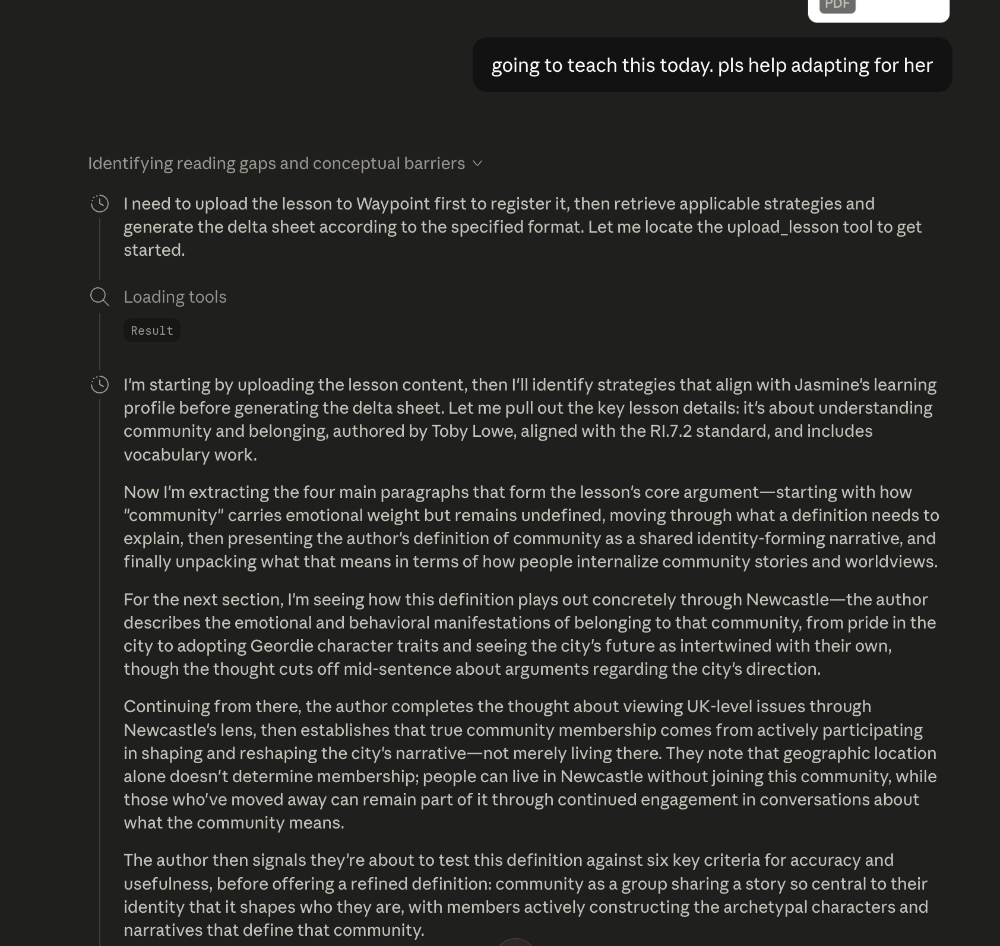
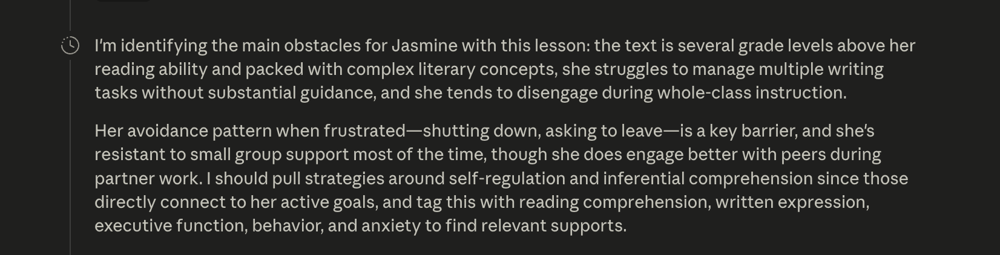
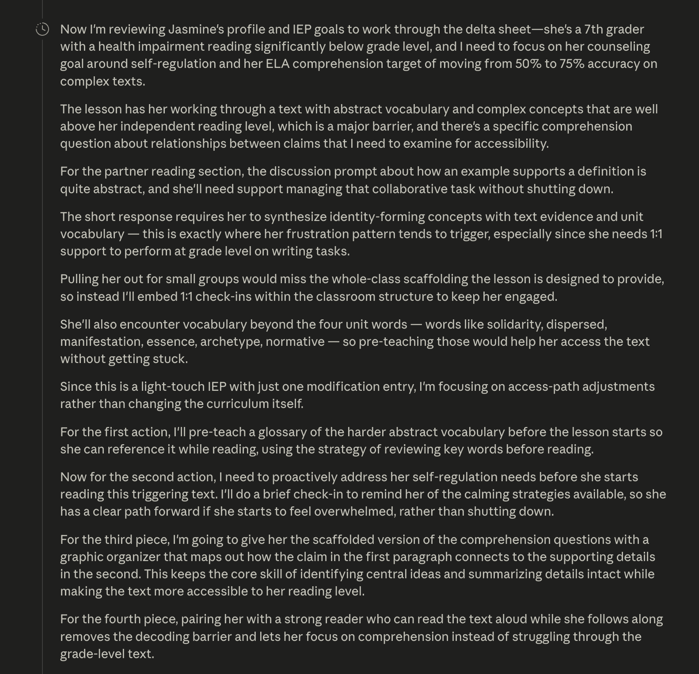
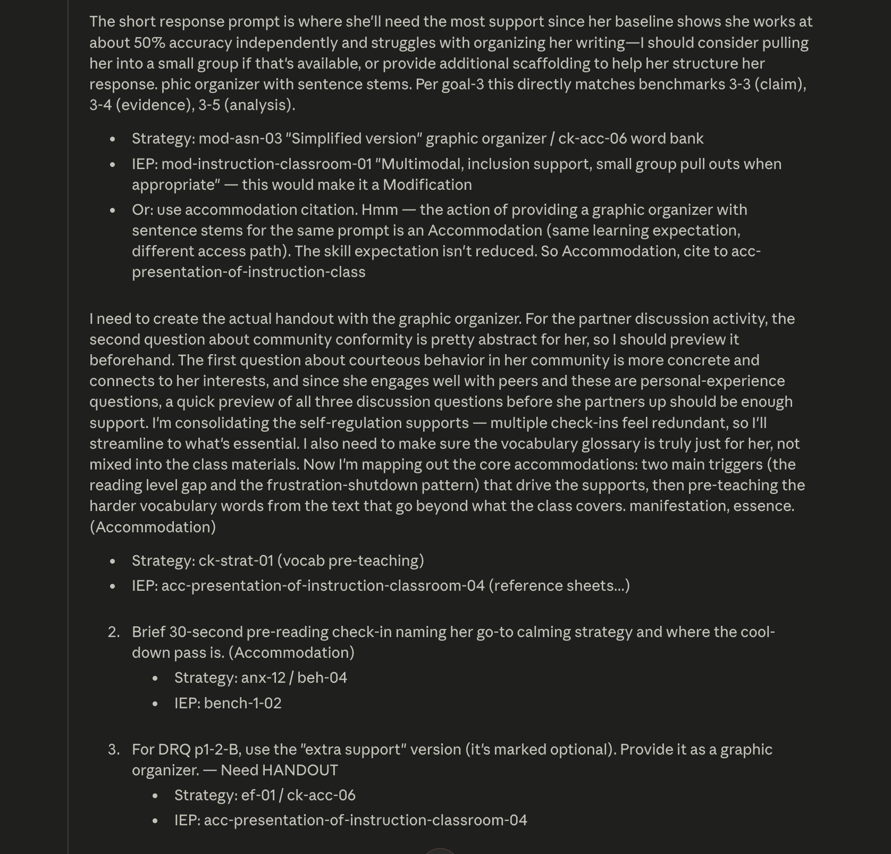

# Waypoint MCP Server

## Repo layout (showed here only the important ones)

```
src/
  instructions.ts       # Keep the modification rules for claude. Primary driver of what teacher finally gets
  types/                # Claude is instructed to convert the uploaded data per these types
    iep.ts              # zod input schema + stored type
    lesson.ts           # same for lessons
  tools/
    upload.ts           # upload_iep, upload_lesson
    retrieve.ts         # find_student, find_lesson, list_*
    strategies.ts       # list_strategies_catalog, get_strategies
  domain/
    catalog.ts          # curated library catalog loader
    strategies.ts       # tag-based retrieval
    tags.ts             # canonical tag vocabulary
  storage/
    iep.ts, lessons.ts, slugify.ts   # file-system persistence
  utils/
    ids.ts              # server-side deterministic ID stamping to IEP/Lesson
data/
  domain/               # domain knowledge data that helps claude find strategies and tools per the IEP
    raw/                # source materials used to generate the curated data
    curated/
      role/server-instructions.md   # MCP instructions content
      # Rest is the parsed domain specific data for pulling strategies relevant for IEP sections
file-system-db/
  indexed/students/<slug>/iep.json
  indexed/lessons/<slug>/lesson.json
```

## High-level flow



## Add the server to Claude Desktop

1. Build the server once:
   ```bash
   npm install
   npm run build
   ```
2. Open Claude Desktop → **Settings** → **Developer** → click **Edit Config**. Claude Desktop will open `claude_desktop_config.json` in your default editor.
3. Add a `waypoint` entry under `mcpServers` (or create the block if it doesn't exist. Also note if there is already an root object, add only the inner "mcpServers" object inside that and not the outer curly braces):
   ```json
   {
     "mcpServers": {
       "waypoint": {
         "command": "node",
         "args": ["<absolute-path-to-this-repo>/dist/index.js"]
       }
     }
   }
   ```
   Replace `<absolute-path-to-this-repo>` with the full path on your machine (e.g., `/Users/you/waypoint-challenge`). Tip: `pwd` from inside the repo prints it.
4. Save the file and fully **quit + reopen** Claude Desktop. Once it's back, `waypoint` should appear under Settings → Developer with status "running" and the eight tools listed.

## Architecture

#### The problem this implementation is solving

A teacher pasting an IEP and a lesson into Claude today gets _something_, but the output is non-deterministic, uncited, and indistinguishable from invention. The teacher can't tell which parts came from the IEP, which from research-backed practice, and which Claude made up. Iterating to usable output takes many turns.

#### My solution

Capture the uploaded IEP and lesson into structured JSON, keeping only the meaningful sections (present-levels, accommodations, modifications, goals, and the lesson's activities), and stamp every leaf with a stable ID. Pair this with a hand-curated library of accommodation/modification strategies, also ID-stamped.

Constrain Claude to reason from exactly three sources: the registered IEP, the registered lesson, and the curated strategy library. Force every action to cite a specific IEP item ID and a specific strategy ID. Shape the output as a delta sheet (short, scannable, action-first) adoptable inside a regular class period, not a parallel lesson plan.

#### Step by step

##### 1. Curated domain knowledge

Claude on its own has broad training, but it's hard to verify where any specific accommodation suggestion comes from. To fix that, I built a hand-curated library of accommodation and modification strategies drawn from established special-education sources, including this [practitioner index from worktogethernc.com](https://worktogethernc.com/resource/ultimate-list-of-iep-accommodations-modifications-strategies-sdis/) and these two practitioner videos: [video 1](https://www.youtube.com/watch?v=O0xdaCEqrU0), [video 2](https://www.youtube.com/watch?v=PsLEhLIy5cM).

Every strategy gets a stable ID. When Claude needs ideas for a particular student, it picks tags from the IEP (like `reading-comprehension`, `anxiety`, or `processing-speed`) and asks the server for matching strategies. The server returns only the items whose tags overlap, and Claude cites the specific strategy ID it used in the final output. So the teacher (or anyone reviewing the plan) can trace every recommendation back to its source instead of trusting Claude's memory (we can also drop ids for teachers).

##### 2. IEP and lesson as structured JSON

The IEP and lesson arrive as PDFs. The naive approach is to read them as plain text, chunk with regex, and let Claude search through the chunks at runtime. That's slow, fragile (any new IEP format breaks the regex), and leaves Claude with no way to point at "the third benchmark of the ELA goal" precisely.

Instead, Claude does the extraction once at upload time, guided by a strict schema. It reads the PDF directly and submits the meaningful sections (present-levels, accommodations, modifications, goals, plus the lesson's vocabulary, paragraphs, questions, etc.) as structured JSON. The server validates the shape, stamps a stable ID on every leaf, and saves it.

This buys four things:

1. Claude jumps straight to the field it needs by name. No grepping through plain text.
2. Boilerplate (signatures, legal headers, page numbers) is filtered out at extraction, so the stored data is only what gets used.
3. Every leaf has its own ID. When Claude proposes an action it cites the exact source.
4. No regex parser to maintain. Different IEP layout from a different school? Claude still maps it to the same schema.

Caveat: the IEP and lesson schemas are tuned to the sample documents shipped with this challenge. A production version would need a more flexible (or versioned) schema to handle the wide variation across schools, states, and curricula.

Trade-offs we accepted with this approach:

1. **The schema is fixed.** Our zod schema mirrors the IEP template Waypoint provided. Different states or schools format IEPs differently, so a new layout means editing the schema or adding a mapping layer. Universal IEP intake is not solved here.
2. **Extraction quality depends on Claude's reading.** Server-side regex parsing would be fragile but deterministic (same PDF, same output every time). Letting Claude do the extraction is smarter but it occasionally misreads (one accommodation landed in the wrong column during testing). Two uploads of the same PDF can produce slightly different JSON.
3. **Minor costs.** Validation is shape-only (won't catch transcription errors), there is no partial-parse fallback, no round-trip pointer from a JSON value back to its location in the source PDF, and including the schema in tool definitions adds some token overhead.

##### 3. Claude is the only LLM in the loop

The Waypoint server makes zero LLM calls of its own. It is a context provider and tool layer; Claude (in Claude Desktop) is the only model that reasons about anything.

Reason this matters:

Whatever the teacher reads is what Claude produced. No second model pre-shapes or post-processes the output, so there are no places where two models can disagree about the same content.

##### 4. How Claude reasons over the three sources

With both files registered, Claude has three sources to work from:

1. The student's IEP JSON (present-levels, accommodations, modifications, goals).
2. The lesson JSON (vocabulary, paragraphs, activities, questions).
3. The curated strategy library (retrieved on demand by tags).

Claude walks the lesson in order. For each activity it asks:

- Is there something in this student's IEP that suggests they will struggle with this part?
- Is there a curated strategy that addresses that struggle for this kind of activity?

If both answers are yes, Claude produces a teacher action. The action names the specific lesson moment, cites the IEP item that documents or authorizes the support, and cites the strategy it drew from. If either side is missing, the action is not added.

We instruct Claude to follow this flow through three channels: the MCP server's `instructions` field (loaded once when Claude Desktop connects to Waypoint), per-tool descriptions on each Waypoint tool, and a `rules` field embedded in every relevant tool response. The tool-response `rules` field carries the output shape and citation requirements.

##### 5. What the teacher actually sees

Initial outputs were as long as the original lesson. Claude produced a full parallel student packet, with modified vocabulary sheet, modified questions, rewritten short response, every activity covered. After putting myself in the teacher's shoes, that approach falls apart in practice. A teacher with three IEP students in the same class would be juggling three parallel lesson plans plus the regular one inside a 45-minute period.

What the teacher actually wants is a short list of what to do _differently_ for this student during the regular lesson. So the output is shaped as a delta sheet: a header naming the student, the lesson, and the IEP triggers; then a numbered list of teacher actions in lesson order, each carrying its strategy and IEP citations; and where a student artifact is needed (a sentence-stem organizer, a vocabulary card), a copyable handout block sits inside that action.

Every action carries three things: a `Strategy:` line citing the curated entry by ID, an `IEP:` line citing the IEP item by ID, and a `(Accommodation)` or `(Modification)` tag at the end of the action sentence. Three pieces of provenance per action, so nothing in the output is unsourced and the legal accommodation-vs-modification distinction is explicit.

This shape is instructed to Claude via the `MODIFICATION_RULES` block embedded in every relevant tool response, so the model follows the schema rather than reinventing presentation each time.

No part of the output is hardcoded or referenced in any way in the `MODIFICATION_RULES`. Its truly generic and written in a way that it supports all kinds of IEP and Lessons.

##### 6. Here's what teacher gets

> #### Jasmine Bailey — "What is 'community' and why is it important?"
>
> Trigger: third-grade reading vs grade-level text: goal-3
> Trigger: academic frustration leads to avoidance: pl-academics
>
> Before the intro slide deck, hand Jasmine her vocab card and spend 2-3 minutes one-on-one walking through the four lesson words plus the four most blocking text terms (solidarity, archetype, normative, identity-forming). (Accommodation)
> HANDOUT — Vocab card:

```
JASMINE — VOCAB FOR "WHAT IS COMMUNITY?"

aspect = one part of something
   Ex: One aspect of school is having friends.

moral = about what is right or wrong
   Ex: Stealing is a moral problem.

narrative = a story
   Ex: The book tells the narrative of a girl.

specific = exact, not general
   Ex: Pick a specific example from the text.

solidarity = people sticking together
   Ex: Teammates show solidarity when they help each other.

archetype = a typical example or character
   Ex: A superhero is an archetype of a hero.

normative = about what people SHOULD do
   Ex: "Be kind to neighbors" is a normative rule.

identity-forming = something that helps make you who you are
   Ex: Speaking Spanish at home can be identity-forming.
```

> - _**Strategy:** Pre-teach key vocabulary before reading: ck-strat-01_
> - _**IEP:** Reference sheets and graphic organizers: acc-presentation-of-instruction-classroom-accommodations-04_
>
> #### Give Jasmine the DRQ note-catcher when whole-class reading begins, and direct her to fill in each section as the class moves through the text rather than answering on the standard student copy. (Accommodation)
>
> HANDOUT — DRQ note-catcher:

```
JASMINE — DURING-READING NOTES

PARAGRAPHS 1-2

A. (Talk) What does Lowe say about the word "community" in p.1?
   My idea: ________________________________________

C. (Talk) Three things every community has (from the bullet list):
   1. ________________________________________
   2. ________________________________________
   3. ________________________________________

PARAGRAPHS 3-7 — Newcastle example

A. (Write) How does Lowe show he is part of the Newcastle community?
   He shows it by _____________________________________
   He also ___________________________________________

B. (Talk) A community I am part of: _____________________
   How my community fits Lowe's definition
   (we share a story about ____________________):
   _________________________________________________

PARAGRAPH 8

A. (Talk) Why does Lowe write a SECOND bullet list in this section?
   My idea: ________________________________________

B. (Write) Three reasons Lowe's definition works:
   1. ________________________________________
   2. ________________________________________
   3. ________________________________________

PARAGRAPHS 10-11

Find Evidence: HIGHLIGHT in your text —
   - ONE sentence that says what community IS
   - ONE sentence that says why community MATTERS
```

> - _**Strategy:** Provide study guide before reading: rc-acc-06_
> - _**IEP:** Accurately annotate a given text: bench-3-01_
>
> ### At the transition from partner reading (paragraphs 3-7) into whole-class paragraph 8, do a 30-second 1:1 check-in: ask Jasmine which calming strategy she'll use if she gets stuck on the abstract section, and let her know she can take a movement break before the short-response prompt if she needs one. (Accommodation)
>
> - Strategy: Allow breaks and opportunities for action: anx-08
> - IEP: Initiate a calming strategy independently: bench-1-02
>
> ### When the class moves to the short-response prompt, swap her blank response page for the scaffolded version below before she starts writing. (Accommodation)
>
> HANDOUT — Short-response scaffold:

```
JASMINE — SHORT RESPONSE SCAFFOLD

Prompt: Explain what Lowe means when he says a community is
"a group of people who share an identity-forming narrative."
Use at least TWO details from the text and unit vocab words.

WORD BANK: aspect • narrative • specific • moral • archetype • shared

CLAIM (1 sentence): What does Lowe mean?
When Lowe says a community shares an "identity-forming narrative,"
he means that ____________________________________________
___________________________________________________________.

EVIDENCE 1: Find a sentence or example from the text.
In paragraph ___, Lowe says: "________________________________
__________________________________________________________."

EXPLAIN: What does that show about his definition?
This shows that ___________________________________________.

EVIDENCE 2: Find another sentence or example.
Lowe also gives the example of ______________________________
__________________________________________________________.

EXPLAIN: What does that show?
This shows that ___________________________________________.

CHECK YOUR WORK:
[ ] I answered what Lowe MEANT (the claim).
[ ] I used two details from the text.
[ ] I used at least one vocab word.
```

> - _**Strategy:** Word bank for written expression: ck-acc-06_
> - _**IEP:** Write a claim answering each part: bench-3-03_

## Tests

I did not ship a test suite. The test I wanted was end-to-end (spin up the MCP server as a subprocess, call the Anthropic API with the teacher prompt, assert on the output) but ran out of time, and the LLM step also makes assertions inherently flaky: the same prompt and the same data can produce slightly different output across runs, so writing checks loose enough not to flake but tight enough to catch regressions needs more careful thought. For this submission, verification was done manually in Claude Desktop.

## Claude's reasoning during a real run

A few screenshots from Claude's thinking pane while producing the output above. They show the IEP / lesson / strategy grounding happening live: Claude reading the registered IEP, evaluating the lesson activities against it, and retrieving curated strategies before composing the delta sheet.










